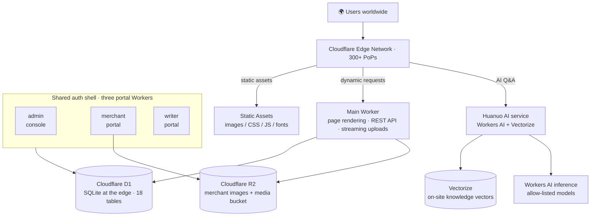

<div align="center">


# Whizzzest · 焰境·万载

**One glimpse, a thousand years of fire.**

A modern culture & tourism platform for Wanzai, Jiangxi — "the Home of Fireworks in China". Fireworks heritage, intangible cultural heritage, local cuisine, travel routes, an in-browser fireworks simulator, and an AI travel guide, all in one place.

[**🌐 whizzzest.com**](https://whizzzest.com) · [▶ Digital Fireworks](https://whizzzest.com/digital-fireworks/) · [📺 Wanzai TV](https://whizzzest.com/tv/) · [🤖 AI Guide](https://whizzzest.com/)

[](https://workers.cloudflare.com/)
[](#engineering-deep-dives)
[](#engineering-deep-dives)
[](https://whizzzest.com/)
[](#license)

**[简体中文](README.md) | English**

</div>

---

## Contents

- [Live Experience](#live-experience)
- [Highlights](#highlights)
- [Feature Tour](#feature-tour)
- [Architecture](#architecture)
- [Engineering Deep Dives](#engineering-deep-dives)
- [Project Scale](#project-scale)
- [Engineering Quality](#engineering-quality)
- [Local Development](#local-development)
- [Data Model](#data-model)
- [Team & Partners](#team--partners)
- [Contact](#contact)
- [License](#license)

---

## Live Experience

> No sign-up required. The whole site is a PWA — installable on desktop and mobile.

| Entry | Link | Highlights |
| --- | --- | --- |
| 🏠 Main site | [whizzzest.com](https://whizzzest.com/) | Full-screen fireworks hero, all modules |
| 🎆 Digital Fireworks | [whizzzest.com/digital-fireworks](https://whizzzest.com/digital-fireworks/) | Pure in-browser fireworks simulator |
| 🤖 "Huanuo" AI Guide | [whizzzest.com](https://whizzzest.com/) (bottom-left on any page) | On-site RAG Q&A with traceable sources |
| 📺 Wanzai TV | [whizzzest.com/tv](https://whizzzest.com/tv/) | Original drama series, promos, live fireworks |
| 🎵 Wanzai Music | [whizzzest.com/music](https://whizzzest.com/music/) | Local music player |
| 📚 Yanjing Library | [whizzzest.com/library](https://whizzzest.com/library/) | Serialized fiction by local authors |
| 🏪 Yanjing Shops | [whizzzest.com/merchants](https://whizzzest.com/merchants/) | Merchant directory + self-service onboarding |

---

## Highlights

**Cultural depth**

- **1,400 years of fireworks culture**: Wanzai firecrackers date back to the Tang dynasty; listed as National Intangible Cultural Heritage in 2008, with 4,000+ product variants sold to 40+ countries
- **5 intangible heritage items** presented systematically: firecrackers, Desheng drum, ramie weaving, open-mouth Nuo opera, Zhishan folk songs — each with its own page, imagery and long-form articles
- **Local cuisine, fully covered**: the "Six Great Bowls" of Wanzai, Luocheng rice noodles, lily products and 15+ regional specialties, each with recipe / history / taste notes
- **A living local content ecosystem**: serialized local fiction, original short dramas and city promo films on Wanzai TV

**Engineering**

- **AI-native**: built-in assistant "Huanuo" (花傩) — on-site RAG over Workers AI + Vectorize hybrid semantic retrieval, answers carry traceable knowledge sources
- **Zero-dependency frontend**: no frontend framework at all — vanilla HTML/CSS/JS with a custom build pipeline; ~1.5 s first load on slow 3G
- **Global edge computing**: fully hosted on Cloudflare's 300+ edge locations; static assets served from the edge, dynamic pages rendered nearby by Workers
- **Immersive interaction**: a Canvas + Web Audio fireworks simulator — pick your shells, choreograph the show, light up Wanzai's night sky in the browser
- **Complete merchant loop**: listing, self-service onboarding, email-code login, certification & pinned ranking — end to end
- **Zero privacy leakage**: no third-party analytics / ads / font scripts anywhere

---

## Feature Tour

| Module | Link | Description |
| --- | --- | --- |
| Home | [/](https://whizzzest.com/) | Hero carousel, core features, spots, shops, TV, music |
| Heritage | [/heritage](https://whizzzest.com/heritage/) | 5 heritage items, each with a dedicated sub-page |
| Cuisine | [/cuisine](https://whizzzest.com/cuisine/) | Six Great Bowls, dishes and traditional specialties |
| Fireworks industry | [/industry](https://whizzzest.com/industry/) | History, current landscape, fireworks companies |
| Viewing spots | [/spots](https://whizzzest.com/spots/) | Wanzai Ancient Town "Kiss of Fireworks" show, Longhu Park |
| Attractions | [/attractions](https://whizzzest.com/attractions/) | Ancient Town, Zhushan Cave, Jiulong Forest and more |
| Travel routes | [/tourism](https://whizzzest.com/tourism/) | Fireworks / heritage / food / landscape themed routes |
| Wanzai TV | [/tv](https://whizzzest.com/tv/) | Video channel with backend streaming uploads |
| Wanzai Music | [/music](https://whizzzest.com/music/) | Player with loop modes / download / share / deep links |
| Yanjing Library | [/library](https://whizzzest.com/library/) | Serialized platform with two-level content review |
| Digital Fireworks | [/digital-fireworks](https://whizzzest.com/digital-fireworks/) | Multi-shell, multi-effect fireworks simulator |
| Yanjing Shops | [/merchants](https://whizzzest.com/merchants/) | Merchant directory, self-service onboarding, certification |
| AI guide | any page | "Huanuo" on-site RAG Q&A |

<table>
  <tr>
    <td width="50%"><br><sub>Digital Fireworks — Canvas particle system + Web Audio, fully in-browser</sub></td>
    <td width="50%"><br><sub>Huanuo AI guide — on-site RAG with cited knowledge sources</sub></td>
  </tr>
  <tr>
    <td width="50%"><br><sub>Wanzai TV — video channel with large-file streaming uploads</sub></td>
    <td width="50%"><br><sub>Yanjing Shops — search / category filters / certified-merchant badge</sub></td>
  </tr>
</table>

**Sub-sites & admin** (three independently deployed portal Workers, shared auth shell + Passkey)

| Sub-site | Domain | Description |
| --- | --- | --- |
| Admin console | `admin.whizzzest.com` | Multi-account management, content review, visitor analytics, media uploads (Cloudflare Access + app password / Passkey double gate) |
| Merchant portal | `merchant.whizzzest.com` | Merchant onboarding, listing management, certification |
| Writer portal | `writer.whizzzest.com` | Writer sign-up, work / chapter management, review submission |

---

## Architecture



| Layer | Technology | Notes |
| --- | --- | --- |
| **Frontend** | Vanilla HTML / CSS / JavaScript | Zero frameworks, zero runtime deps, system font stack, frosted-glass visual language |
| **Build** | Custom `build.js` (Node.js) | Zero-dep pipeline: template engine, page auto-discovery, data-driven rendering, sitemap/robots, hash cache busting |
| **Image optimization** | `sharp` (optional devDependency) | Build-time responsive multi-width WebP; build works without it |
| **Hosting** | Cloudflare Workers + Static Assets | Static from the edge, Worker-first dynamic routes via `run_worker_first` |
| **Database** | Cloudflare D1 (SQLite) | Merchants, library, TV, music, attractions, messages, admin accounts, visitor analytics |
| **Object storage** | Cloudflare R2 | Merchant image bucket + media bucket, proxied reads via Worker |
| **AI** | Cloudflare Workers AI + Vectorize | On-site inference, no external API keys; RAG generation |
| **Auth** | WebAuthn Passkey + email codes | Shared auth shell across three portals; admin adds a Cloudflare Access gate |
| **Email** | Cloudflare Workers + SMTP | Merchant verification codes, contact forms |
| **PWA** | Service Worker + Web App Manifest | Offline caching, installable, offline fallback page |
| **Deployment** | GitHub Actions | push to `main` → build + four-Worker dry-run checks + Wrangler deploy |

**Performance**

- ~**1.5 s** first load on slow 3G; Lighthouse Performance **95+**
- **< 50 ms** edge latency across 300+ locations
- Immutable caching with content-hash filenames
- **No third-party scripts** — zero analytics / ads / webfont requests

---

## Engineering Deep Dives

> Every item maps to real code in this repository.

**1. Shared auth shell + Passkey (WebAuthn)**
`shared/portal-ui.js` + `shared/webauthn.js` power login and account centers for all three portals (admin / merchant / writer) from a single codebase — UI changes land once and apply everywhere. Passkeys are standard WebAuthn (server-side `@simplewebauthn/server`); the admin console stacks Cloudflare Access on top of app passwords, forming a three-layer gate: network → account → key.

**2. Huanuo AI: hybrid semantic retrieval on Vectorize**
Workers AI inference plus Vectorize vector search, blended with keyword matching and an entity-pool recall; every answer cites its knowledge sources. Retrieval failures trip a circuit breaker and degrade gracefully to lexical matching; models are allow-listed; a regression suite (`scripts/ai-retrieval-test.mjs`) guards answer quality, and semantic retrieval and realtime data fetch run in parallel to cut latency.

**3. Zero-dependency build pipeline**
`build.js` uses only Node built-ins: a hand-rolled template engine (partials / `{{#each}}` loops / dot-path lookup / automatic HTML escaping), page auto-discovery (create a directory, get a page), data-driven rendering, responsive multi-width WebP, content-hash cache busting, sitemap/robots and Service Worker manifest injection — all in one command.

**4. 95 MB streaming uploads**
Wanzai TV uploads stream straight into R2 via `FixedLengthStream` — fully streaming, never buffered in memory, up to 95 MB per file; Bilibili-sourced covers get referer-fallback handling.

**5. Installable PWA with offline fallback**
manifest + Service Worker with the asset manifest and dirty-stamp injected at build time; audio caching strips Range requests to cache whole streams — pages render fully offline on weak networks.

**6. Digital fireworks simulator**
Pure in-browser Canvas particle system with Web Audio sound: multiple shells, effects and choreography, custom background images (IndexedDB local gallery), fullscreen immersive mode — no backend involved.

**7. The full merchant loop**
Email-code login → self-service onboarding → back-office review → certification and pinned ranking; images stored in R2 and proxied by a Worker; paired with a visitor analytics dashboard — an operable local merchant ecosystem.

---

## Project Scale

| Metric | Value |
| --- | --- |
| Independently deployed Workers | **4** (main site / admin / merchant / writer) |
| Build-time static pages | **15+** (plus dynamic routes) |
| D1 tables | **18** |
| R2 buckets | **2** (merchant images / TV·music media) |
| Frontend runtime dependencies | **0** |
| Backend runtime dependencies | **1** (`@simplewebauthn/server`, required for WebAuthn) |
| Design documents | **12** (in `docs/`) |
| Smoke-test assertions | **15** (`scripts/smoke.sh`, run locally) |

---

## Engineering Quality

- **CI/CD**: a two-stage GitHub Actions pipeline — build + dry-run self-check across all four Workers → deploy main site and the three portals
- **Locally reproducible smoke tests**: `scripts/smoke.sh` — 15 assertions, one command to health-check every critical path. Smoke tests deliberately stay out of CI: the edge challenge blocks datacenter traffic, so they run locally
- **Design-driven development**: 12 design documents (AI assistant, library, TV, merchants, PWA, digital fireworks, visitor governance, …) live in `docs/` — design first, then implement, continuously revised
- **Disciplined DB migrations**: `schema.sql` is the full-schema blueprint (not directly executable); all changes go through numbered migrations in `scripts/migrations/` — additive-only, applied to both remote and local, executed before merge

---

## Local Development

> This repository belongs to the Whizzzest team and is public for showcase and learning purposes only (see License).

**Requirements**: Node.js 22 (same as CI); optional Wrangler CLI for local Worker debugging

```bash
git clone https://github.com/nathanpenny520/whizzzest.com.git
cd whizzzest.com

npm install        # only sharp (build-time WebP); the build works without it
npm run build      # zero-dep build, output in dist/

# static preview (no dynamic features)
python3 -m http.server 8788 -d dist

# full Worker environment (requires local D1/R2 setup)
npx wrangler dev
```

```bash
# local D1 init (optional): run numbered migrations 001→003 in order
npx wrangler d1 execute whizzzest --local --file=scripts/migrations/001-20260907-ai-knowledge.sql
npx wrangler d1 execute whizzzest --local --file=scripts/migrations/002-20260908-webauthn-credentials.sql
npx wrangler d1 execute whizzzest --local --file=scripts/migrations/003-20260908-visits-governance.sql
```

Deployment uses `npx wrangler deploy` (main site) plus `--config admin|merchant|writer/wrangler.jsonc` (the three portals); production is deployed automatically by GitHub Actions. For the template engine syntax and page-authoring guide, see [docs/设计架构与方案.md](docs/设计架构与方案.md) (Chinese).

---

## Data Model

Core tables (18 in total; [schema.sql](schema.sql) is the full-schema blueprint — all schema changes go through numbered migrations in [scripts/migrations/](scripts/migrations/)):

| Table | Description |
| --- | --- |
| `merchants` | Merchant listings (category / address / images / certification / pin weight) |
| `merchant_sessions` | Merchant email-code login sessions |
| `library_works` / `library_chapters` | Library works and chapters (two-level review states) |
| `tv_videos` | Wanzai TV videos (R2 keys / duration / category) |
| `music_tracks` | Wanzai music (R2 keys / duration / cover) |
| `attractions` | Tourist attractions (coordinates / images / ordering) |
| `messages` | Visitor messages |
| `admin_users` | Admin accounts (PBKDF2 hashes / permissions) |
| `visitors` | Visitor analytics (path / UA / truncated IP) |
| `ai_knowledge` | AI knowledge base (content / vectors / sources / category) |

---

## Team & Partners

Whizzzest (焰境·万载) was founded by university students in Beijing who love their hometown culture — a core team of 6 plus an AI teammate:

| Member | Role | Focus |
| --- | --- | --- |
| 龙紫琴 (Long Ziqin) | Project lead | Strategy, coordination, partnerships |
| 聂磐 (Nie Pan) | Tech architect | Full-stack development, systems architecture, zero-dep build pipeline |
| 黄婧瑶 (Huang Jingyao) | Brand operations director | New-media matrix operations, brand communication |
| 龙子萱 (Long Zixuan) | Video creative director | Visual content planning & production, Wanzai TV |
| 闻可佳 (Wen Kejia) | Content strategy director | Content planning, project proposals, brand narrative |
| Claude AI | AI teammate | Huanuo Q&A engine, copywriting, code review, visual creation |

**Partners**: Wanzai Culture & Tourism Bureau · Wanzai Ancient Town · Caitian Artistic Fireworks · Tailin Firecrackers

---

## Contact

- **Website**: [whizzzest.com](https://whizzzest.com/)
- **Email**: [contact@whizzzest.com](mailto:contact@whizzzest.com)
- **Customer service**: [chat with us](https://work.weixin.qq.com/kfid/kfc339afcb020ce4dd8)
- **WeChat**: 云上万载 - 焰遇乡旅 (official account) · 焰境·万载 (video account)
- **Douyin**: [@焰境·万载](https://www.douyin.com/user/MS4wLjABAAAA0fPcuNv5vy46rDu3W1laQUVvZQiyr9MbDl7E60WUnrOKVkG_JKKy68tZiWA_L3A8)
- **Xiaohongshu**: [@焰境·万载](https://www.xiaohongshu.com/user/profile/69a2d84a0000000021023fd4)
- **Bilibili**: [@焰境·万载](https://space.bilibili.com/3546949301045835)

---

## License

Copyright © **Whizzzest (焰境·万载) team**. All rights reserved.

This repository is public for showcase and learning purposes only. Without prior written permission from the copyright holders, you may not copy, modify, distribute, sublicense, or use it for commercial purposes. See [LICENSE](LICENSE).

---

<div align="center">

**One glimpse, a thousand years of fire.**

Bringing AI to county-level tourism — let a thousand years of fireworks culture keep blooming in the digital world.

</div>
