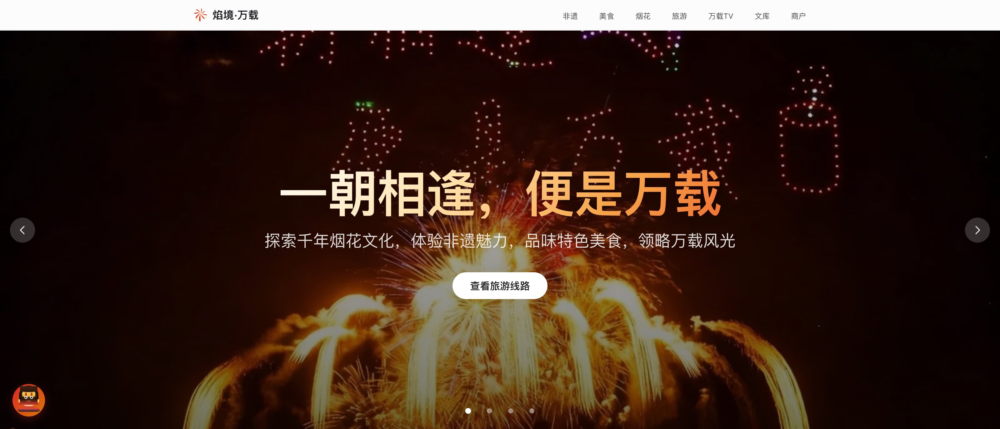
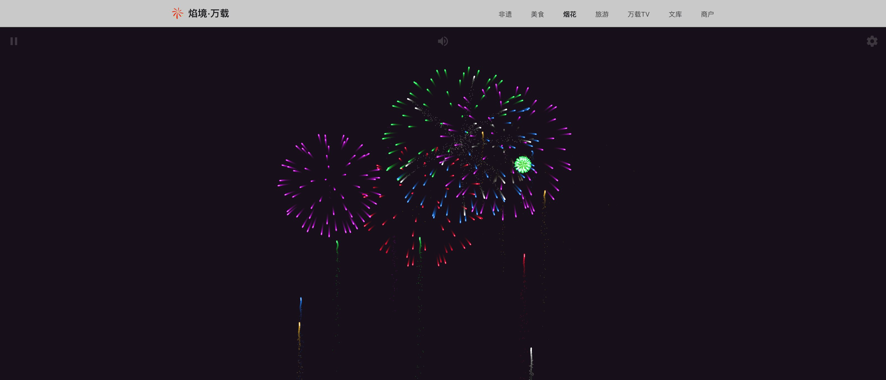
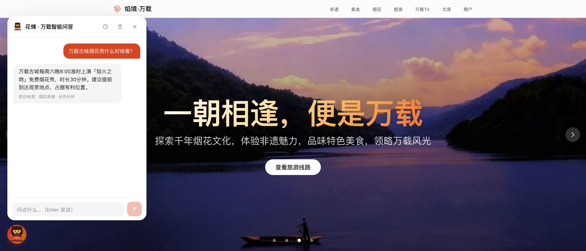
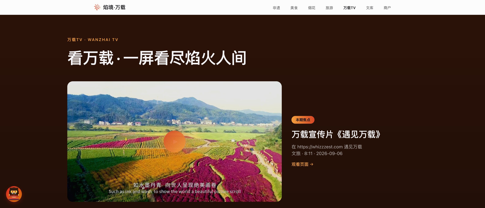
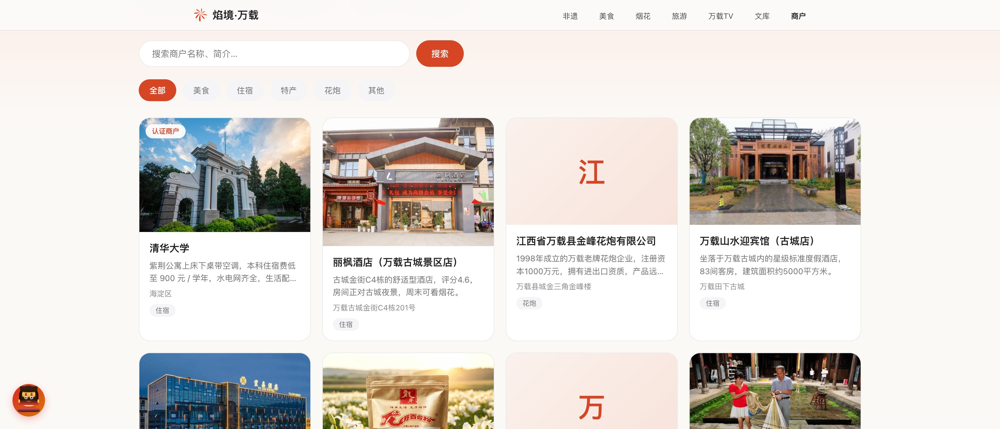
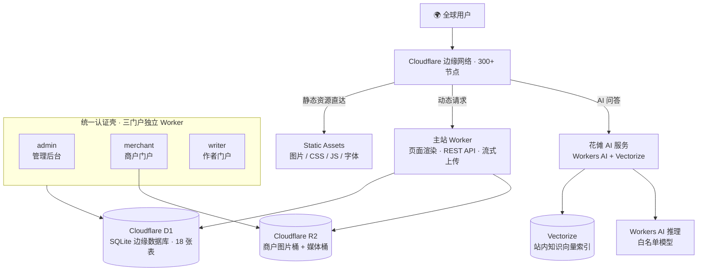

<div align="center">



# 焰境・万载

**一朝相逢，便是万载。**

围绕「中国花炮之乡」江西万载打造的现代化文旅数字平台——烟花文化、非遗传承、美食特产、旅游线路、数字烟花体验、AI 智能向导，一站式呈现。

[**🌐 whizzzest.com**](https://whizzzest.com) · [▶ 数字烟花](https://whizzzest.com/digital-fireworks/) · [📺 万载TV](https://whizzzest.com/tv/) · [🤖 AI 问答](https://whizzzest.com/)

[](https://workers.cloudflare.com/)
[](#技术攻坚)
[](#技术攻坚)
[](https://whizzzest.com/)
[](#版权声明)

**[English](README.en.md) | 简体中文**

</div>

---

## 目录

- [在线体验](#在线体验)
- [项目亮点](#项目亮点)
- [功能巡礼](#功能巡礼)
- [技术架构](#技术架构)
- [技术攻坚](#技术攻坚)
- [项目规模](#项目规模)
- [工程化与质量保障](#工程化与质量保障)
- [本地开发](#本地开发)
- [数据模型](#数据模型)
- [团队与合作伙伴](#团队与合作伙伴)
- [联系方式](#联系方式)
- [版权声明](#版权声明)

---

## 在线体验

> 无需注册，打开即用；全站支持 PWA 安装到桌面 / 手机。

| 体验入口 | 链接 | 看点 |
| --- | --- | --- |
| 🏠 主站 | [whizzzest.com](https://whizzzest.com/) | 首屏烟花影像、全模块导航 |
| 🎆 数字烟花 | [whizzzest.com/digital-fireworks](https://whizzzest.com/digital-fireworks/) | 纯浏览器烟花模拟器，亲手放一场焰火 |
| 🤖 花傩 AI 问答 | [whizzzest.com](https://whizzzest.com/)（任意页面左下角） | 站内知识库 RAG 问答，回答附知识来源 |
| 📺 万载 TV | [whizzzest.com/tv](https://whizzzest.com/tv/) | 短剧《一朝相逢便是万载》、宣传片、烟花实况 |
| 🎵 万载音乐 | [whizzzest.com/music](https://whizzzest.com/music/) | 本地音乐播放器，主题曲《有一个地方叫万载》 |
| 📚 焰境文库 | [whizzzest.com/library](https://whizzzest.com/library/) | 本地作者连载小说与随笔 |
| 🏪 焰境好店 | [whizzzest.com/merchants](https://whizzzest.com/merchants/) | 商户指南 + 自助入驻 + 认证体系 |

---

## 项目亮点

**文化深度**

- **1400 年烟花文化**：万载花炮始于唐、盛于宋，2008 年列入国家级非物质文化遗产，4000 多个规格品种畅销全球 40 多个国家和地区
- **5 项非遗系统化呈现**：万载花炮、得胜鼓、夏布织造、开口傩、纸棚山歌，每项独立页面 + 影像资料 + 详细图文
- **地道美食全收录**：万载六大碗、罗城扎粉、龙牙百合、南酸枣糕等 15+ 道特色美食，每道含做法 / 历史 / 口感
- **本地内容生态**：文库连载本地作者作品，万载 TV 播出自制短剧与城市宣传片

**技术特色**

- **AI 原生**：内置 AI 助手「花傩」，Workers AI + Vectorize 语义混合检索的站内 RAG，回答附可追溯知识来源
- **零依赖前端**：不用任何前端框架，纯原生 HTML/CSS/JS + 自研构建管线，弱网首屏约 1.5 秒
- **全球边缘计算**：全站托管于 Cloudflare 300+ 边缘节点，静态资源直达边缘，动态内容由 Worker 就近渲染
- **沉浸式交互**：Canvas + Web Audio 数字烟花模拟器，选弹体、定节奏，浏览器里点亮一场万载焰火
- **完整商户闭环**：展示、自助入驻、邮箱验证码登录、认证置顶，全流程打通
- **隐私零泄漏**：全站无第三方分析 / 广告 / 字体脚本，访客 IP 仅截断记录

---

## 功能巡礼

| 模块 | 线上入口 | 说明 |
| --- | --- | --- |
| 首页 | [/](https://whizzzest.com/) | Hero 轮播、核心特色、景点精选、好店、TV、音乐 |
| 非遗文化 | [/heritage](https://whizzzest.com/heritage/) | 5 项非遗概览 + 各非遗独立子页 |
| 美食特产 | [/cuisine](https://whizzzest.com/cuisine/) | 六大碗、其他美食、传统特产 |
| 烟花产业 | [/industry](https://whizzzest.com/industry/) | 产业历史、发展现状、花炮企业 |
| 赏烟地点 | [/spots](https://whizzzest.com/spots/) | 万载古城「焰火之吻」、龙湖公园，含观赏位与交通 |
| 旅游景点 | [/attractions](https://whizzzest.com/attractions/) | 万载古城、竹山洞、九龙原始森林等 |
| 旅游线路 | [/tourism](https://whizzzest.com/tourism/) | 烟花 / 非遗 / 美食 / 山水主题线路 |
| 万载 TV | [/tv](https://whizzzest.com/tv/) | 视频频道，后台流式上传 + B 站内容联动 |
| 万载音乐 | [/music](https://whizzzest.com/music/) | 播放器页：循环三态 / 下载 / 分享 / 深链定位 |
| 焰境文库 | [/library](https://whizzzest.com/library/) | 作品 / 章节双级审核的连载平台 |
| 数字烟花 | [/digital-fireworks](https://whizzzest.com/digital-fireworks/) | 多弹体 / 特效 / 音效的烟花模拟器 |
| 焰境好店 | [/merchants](https://whizzzest.com/merchants/) | 商户指南，自助入驻、认证置顶 |
| AI 助手 | 全站任意页面 | 「花傩」智能问答，站内 RAG |

<table>
  <tr>
    <td width="50%"><br><sub>数字烟花模拟器 —— Canvas 粒子系统 + Web Audio，纯浏览器运行</sub></td>
    <td width="50%"><br><sub>AI 助手「花傩」—— 站内 RAG 问答，回答附知识来源</sub></td>
  </tr>
  <tr>
    <td width="50%"><br><sub>万载 TV —— 视频频道，支持后台大文件流式上传</sub></td>
    <td width="50%"><br><sub>焰境好店 —— 搜索 / 分类筛选 / 认证商户标识</sub></td>
  </tr>
</table>

**子站与后台**（独立部署的三个门户 Worker，统一认证壳 + Passkey）

| 子站 | 域名 | 说明 |
| --- | --- | --- |
| 管理后台 | `admin.whizzzest.com` | 多账号管理、内容审核、访客分析看板、媒体上传（Cloudflare Access + 应用密码 / 通行密钥双门） |
| 商户门户 | `merchant.whizzzest.com` | 商户自助入驻、信息管理、认证申请 |
| 作者门户 | `writer.whizzzest.com` | 作者注册、作品 / 章节管理、提交审核 |

---

## 技术架构



| 层级 | 技术 | 说明 |
| --- | --- | --- |
| **前端** | 原生 HTML / CSS / JavaScript | 零框架、零运行时依赖，系统字体栈，毛玻璃视觉语言 |
| **构建** | 自研 `build.js`（Node.js） | 零依赖构建管线：模板引擎、页面自动发现、数据驱动渲染、sitemap/robots 生成、hash 缓存戳 |
| **图片优化** | `sharp`（可选 devDependency） | 构建期 WebP 响应式多档生成，不装也能构建 |
| **托管** | Cloudflare Workers + Static Assets | 静态资源直达边缘，动态路径 Worker 优先，`run_worker_first` 精细路由 |
| **数据库** | Cloudflare D1（SQLite） | 商户、文库、TV、音乐、景点、留言、管理账号、访客分析 |
| **对象存储** | Cloudflare R2 | 商户图片桶 + 媒体桶，Worker 代理公开读取 |
| **AI** | Cloudflare Workers AI + Vectorize | 站内推理，无需外部 API Key；RAG 检索增强生成 |
| **认证** | WebAuthn Passkey + 邮箱验证码 | 三门户统一认证壳，管理后台叠加 Cloudflare Access 双门 |
| **邮件** | Cloudflare Workers + SMTP | 商户邮箱验证码、联系表单 |
| **PWA** | Service Worker + Web App Manifest | 离线缓存、可安装、离线兜底页 |
| **部署** | GitHub Actions | push `main` 自动构建 + 四端 dry-run 自检 + Wrangler 部署 |

**性能指标**

- 首屏加载约 **1.5 秒**（弱网 3G 环境），Lighthouse Performance **95+**
- 全球边缘延迟 **< 50ms**（300+ 节点）
- 静态资源永久缓存 + hash 文件名戳
- **无第三方脚本**：全站无外部分析 / 广告 / 字体请求

---

## 技术攻坚

> 每一条都对应真实代码，欢迎按图索骥。

**1. 统一认证壳 + Passkey（WebAuthn）**
`shared/portal-ui.js` + `shared/webauthn.js` 一套代码支撑 admin / merchant / writer 三个门户的登录与账户中心，样式与交互只改一处全端生效；通行密钥基于 WebAuthn 标准（服务端 `@simplewebauthn/server`），管理后台在应用密码之上再叠 Cloudflare Access，形成「网络门 + 账号门 + 密钥门」三层防护。

**2. 花傩 AI：Vectorize 语义混合检索**
Workers AI 站内推理 + Vectorize 向量索引做语义检索，混合关键词匹配与实体池召回，回答附「知识来源」可追溯；检索故障自动熔断降级到词法匹配，模型走白名单，配套回归测试脚本（`scripts/ai-retrieval-test.mjs`）守住答案质量，语义检索与实时数据并行点火压低时延。

**3. 零依赖自研构建管线**
`build.js` 仅用 Node 内置模块：自研模板引擎（partial 嵌入 / `{{#each}}` 循环 / 点路径取值 / 自动 HTML 转义）、页面自动发现（建目录即成页）、数据驱动渲染、WebP 响应式多档图片、hash 指纹缓存戳、sitemap/robots 与 Service Worker 清单注入，全部一条命令完成。

**4. 95MB 大文件流式上传**
万载 TV 后台上传直传 R2，基于 `FixedLengthStream` 全程流式处理、不落内存，单文件支持到 95MB；B 站联动内容的封面图做了防盗链降级处理。

**5. PWA 可安装 + 离线兜底**
manifest + Service Worker 双件套，构建期注入资源清单与脏戳；音频缓存对 Range 请求做去 Range 的整流缓存处理，弱网 / 断网页面可完整离线呈现。

**6. 数字烟花模拟器**
纯浏览器 Canvas 粒子系统 + Web Audio 音效，多弹体、多特效、节奏编排，支持自定义背景图（IndexedDB 本地画廊），全屏沉浸式体验——无需任何后端。

**7. 商户闭环全流程**
邮箱验证码登录 → 自助入驻 → 后台审核 → 认证与置顶权重排序，图片走 R2 桶 + Worker 代理读取，配合访客分析数据看板，形成可运营的本地商户生态。

---

## 项目规模

| 指标 | 数值 |
| --- | --- |
| 独立部署的 Worker | **4** 个（主站 / 管理后台 / 商户门户 / 作者门户） |
| 构建期生成的静态页面 | **15+** 页（另含动态路由） |
| D1 数据表 | **18** 张 |
| R2 存储桶 | **2** 个（商户图片 / TV·音乐媒体） |
| 前端运行时依赖 | **0** |
| 后端运行时依赖 | **1**（`@simplewebauthn/server`，WebAuthn 必需） |
| 设计方案文档 | **12** 份（`docs/`） |
| 冒烟测试断言 | **15** 项（`scripts/smoke.sh`，本地复跑） |

---

## 工程化与质量保障

- **CI/CD**：GitHub Actions 双阶段流水线——构建 + 四端 dry-run 自检 → 主站与三门户部署
- **本地冒烟测试**：`scripts/smoke.sh` 15 项断言一键体检全站关键路径；因边缘质询会拦截数据中心流量（CI 无法穿透），冒烟不进 CI、以本地复跑为准
- **设计驱动开发**：12 份专项方案文档（AI 助手、文库、TV、商户、PWA、数字烟花、访客治理等）沉淀于 `docs/`，先方案后实现，持续修订
- **数据库迁移纪律**：`schema.sql` 为全量图纸（不可直接执行），库变更一律走 `scripts/migrations/` 编号迁移——只增不改、远程/本地双执行、先执行后合入

---

## 本地开发

> 本仓库为焰境·万载团队项目，源码开放仅作展示与学习交流之用（版权见文末）。

**环境要求**：Node.js 22（与 CI 一致）；可选 Wrangler CLI（本地 Worker 调试）

```bash
git clone https://github.com/nathanpenny520/whizzzest.com.git
cd whizzzest.com

npm install        # 仅 sharp（构建期 WebP 优化）；不装也能构建
npm run build      # 零依赖构建，产物输出 dist/

# 静态预览（无动态功能）
python3 -m http.server 8788 -d dist

# 完整 Worker 环境（需配置 D1/R2 本地实例）
npx wrangler dev
```

```bash
# 本地 D1 初始化（可选）：依次执行 001→003 编号迁移
npx wrangler d1 execute whizzzest --local --file=scripts/migrations/001-20260907-ai-knowledge.sql
npx wrangler d1 execute whizzzest --local --file=scripts/migrations/002-20260908-webauthn-credentials.sql
npx wrangler d1 execute whizzzest --local --file=scripts/migrations/003-20260908-visits-governance.sql
```

部署采用 `npx wrangler deploy`（主站）+ `--config admin|merchant|writer/wrangler.jsonc`（三门户），线上由 GitHub Actions 自动完成。模板引擎语法、新增页面指引等详见 [docs/设计架构与方案.md](docs/设计架构与方案.md)。

---

## 数据模型

核心数据表（共 18 张；[schema.sql](schema.sql) 为全量图纸，库变更一律走 [scripts/migrations/](scripts/migrations/) 编号迁移）：

| 表名 | 说明 |
| --- | --- |
| `merchants` | 商户信息（分类 / 地址 / 图片 / 认证状态 / 置顶权重） |
| `merchant_sessions` | 商户邮箱验证码登录会话 |
| `library_works` / `library_chapters` | 文库作品与章节（双级审核状态） |
| `tv_videos` | 万载 TV 视频（R2 对象键 / 时长 / 分类） |
| `music_tracks` | 万载音乐（R2 对象键 / 时长 / 封面） |
| `attractions` | 旅游景点（坐标 / 图片 / 排序） |
| `messages` | 访客留言 |
| `admin_users` | 管理后台账号（PBKDF2 哈希 / 权限） |
| `visitors` | 访客分析（路径 / UA / IP 截断） |
| `ai_knowledge` | AI 知识库（内容 / 向量 / 来源 / 分类） |

---

## 团队与合作伙伴

「焰境・万载」由热爱家乡文化的北京高校在读生发起，6 人核心团队 + AI 智能伙伴：

| 成员 | 角色 | 职责 |
| --- | --- | --- |
| 龙紫琴 | 项目负责人 | 全局战略规划与团队协作，资源整合 |
| 聂磐 | 技术架构师 | 全栈开发与系统架构，零依赖构建管线 |
| 黄婧瑶 | 品牌运营总监 | 新媒体矩阵运营与品牌传播策略 |
| 龙子萱 | 视频创意总监 | 视觉内容策划与制作，万载 TV |
| 闻可佳 | 内容战略总监 | 内容规划与项目方案，品牌叙事 |
| Claude AI | 智能赋能助手 | 「花傩」AI 问答驱动、文案生成、代码评审、视觉创作 |

**合作伙伴**：万载县文旅局 · 万载古城景区 · 彩天艺术焰火 · 泰麟花炮

---

## 联系方式

- **官方网站**：[whizzzest.com](https://whizzzest.com/)
- **电子邮箱**：[contact@whizzzest.com](mailto:contact@whizzzest.com)
- **企业客服**：[点击咨询](https://work.weixin.qq.com/kfid/kfc339afcb020ce4dd8)
- **微信公众号**：云上万载 - 焰遇乡旅
- **微信视频号**：焰境・万载
- **抖音**：[@焰境・万载](https://www.douyin.com/user/MS4wLjABAAAA0fPcuNv5vy46rDu3W1laQUVvZQiyr9MbDl7E60WUnrOKVkG_JKKy68tZiWA_L3A8)
- **小红书**：[@焰境・万载](https://www.xiaohongshu.com/user/profile/69a2d84a0000000021023fd4)
- **哔哩哔哩**：[@焰境・万载](https://space.bilibili.com/3546949301045835)

---

## 版权声明

本项目（包括但不限于源代码、文案、图片、设计、数据结构、架构方案）的版权归**焰境・万载团队**所有，保留所有权利。

仓库公开仅作展示与学习交流；未经版权所有者事先书面许可，不得复制、修改、分发、再许可或用于商业用途。详见 [LICENSE](LICENSE)。

---

<div align="center">

**一朝相逢，便是万载。**

用 AI 技术赋能县域文旅，让千年烟花文化在数字世界继续绽放。

</div>
